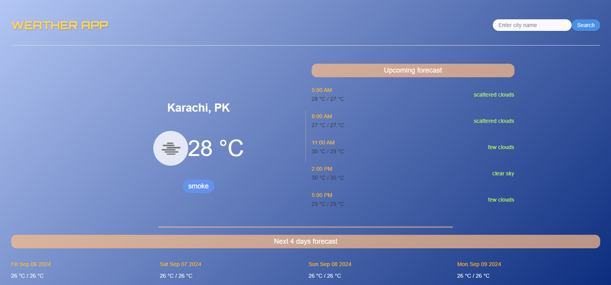

# MERN Weather App

A weather app built with the MERN stack. Detects your location (or search any city), pulls current conditions and a forecast from the OpenWeatherMap API, and logs each lookup to MongoDB.



## Features

- **Geolocation on load**: uses the browser's location API to show weather for where you are, no search needed.
- **City search**: look up any city by name.
- **Current conditions + forecast**: temperature, description, a 5-step hourly forecast, and a 4-day outlook, all from OpenWeatherMap's current weather and forecast endpoints.
- **Query logging**: every lookup is saved to MongoDB (city, country, temperature, description) via a small Express API.

## Tech Stack

**Frontend:** React, Axios
**Backend:** Node.js, Express, MongoDB (Mongoose)
**API:** [OpenWeatherMap](https://openweathermap.org/api)

## Getting Started

### 1. Clone and install

```bash
git clone https://github.com/SyedHamza-Dev/Mern_Weather_App.git
cd Mern_Weather_App

cd server && npm install
cd ../client && npm install
```

### 2. Set up environment variables

Create `server/.env`:

```
MONGODB_URI=your_mongodb_connection_string
PORT=5000
```

Create `client/.env`:

```
REACT_APP_OPENWEATHER_API_KEY=your_openweathermap_api_key
```

Get a free API key at [openweathermap.org/api](https://openweathermap.org/api).

### 3. Run it

```bash
# terminal 1, from server/
node index.js

# terminal 2, from client/
npm start
```

Open [http://localhost:3000](http://localhost:3000).

## Known limitation

The forecast lists (hourly and daily) are rendered with direct DOM manipulation (`document.createElement`) instead of React state, since this was an early project written while still learning the framework. It works, but isn't how the rest of my more recent projects handle rendering.

## Project Structure

```
Mern_Weather_App/
├── server/         # Express API, logs weather queries to MongoDB
└── client/         # React frontend, calls OpenWeatherMap directly
```
